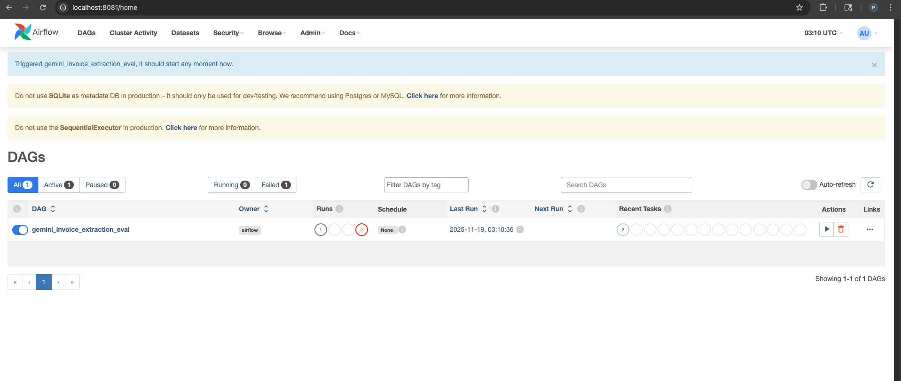

# Model 1 – VertexAI JSON Extraction Pipeline
===========================================

This component implements an automated document-to-JSON extraction system using Google Vertex AI (Gemini models). It is designed primarily for invoices and similar business documents, and is structured into three main phases:

1) Data preparation
2) Dynamic few-shot prompting and inference
3) Evaluation

The code is organized so that it can be run directly via Python or orchestrated via Airflow.

----------------------------------------------------------------------
## Folder structure
----------------------------------------------------------------------

model_1/
  v2_vertex/
    inference.py             -> Main inference script calling Gemini
    validate_llm1.py         -> Evaluation script for predictions
    example_provider.py      -> Builds examples manifest for few-shot prompting
    output/                  -> Inference results (JSON files)
    eval_simple/             -> Evaluation reports (JSON)
    gemini_extraction_dag.py -> Airflow DAG (optional)

data-pipeline/
  data/
    unstructured/
      invoices/
        invoice_X.pdf        -> Input PDFs
        invoice_X.json       -> Ground truth labels (per invoice)

----------------------------------------------------------------------
## 1) Data preparation
----------------------------------------------------------------------

The data preparation step converts raw PDFs and ground truth annotations into a form suitable for prompting and evaluation.

Main steps:

a) PDF to images
   - Each input PDF is converted to one or more page-level PNG images.
   - This is handled by pdf_2_image.py (in the data-pipeline/scripts directory).
   - The function pdf_to_base64_images(path, output_json=False) returns a list
     of objects with base64-encoded PNGs suitable for Gemini's image inputs.

b) Ground truth JSON
   - For each invoice PDF, there is an accompanying JSON file defining the
     expected structured output (e.g., fields like invoice_number, date,
     total_amount, vendor, line_items).
   - These JSON files are stored in data-pipeline/data/unstructured/invoices.

c) Example manifest
   - example_provider.py reads example PDFs and ground truth JSONs and builds
     a manifest (JSONL or list of dicts) that pairs:
       - images (page-level base64 PNGs)
       - expected_json (ground truth for that invoice)
   - The function build_examples_manifest(...) is used by inference.py to load
     these examples for few-shot prompting.

----------------------------------------------------------------------
## 2) Training / prompting – dynamic few-shot prompting
----------------------------------------------------------------------

There is no traditional parameter fine-tuning here; instead, this model uses
dynamic few-shot prompting with Gemini. The idea is to treat the model as a
frozen LLM and "train" it at inference time via carefully selected examples.

Core ideas:

a) Example pool
   - A pool of example invoices is prepared via example_provider.py.
   - Each example contains document images and a corresponding expected JSON.

b) Dynamic example selection (few-shot)
   - For a given target invoice, inference.py uses build_examples_manifest(...)
     to load a set of candidate examples.
   - From this pool, a small number of examples (for example, the first 3 or
     the top-K by some similarity metric) are selected to be included in the
     prompt as few-shot examples.
   - This can be extended to true "dynamic" selection by computing similarity
     between the target document and each example (e.g., by layout, text, or
     metadata) and choosing the closest matches.

c) Prompt construction
   - inference.py builds a sequence of Parts for Gemini:
       - A global instruction that explains the task:
         "You are an information extraction model. Study the following examples
          (document images + JSON). Then extract all information as structured
          JSON for the new document below."
       - For each example:
           1) A small textual header, e.g. "Example i:"
           2) All page images of the example as image Parts
           3) The expected JSON printed as text
       - Then a final section:
           1) A textual header indicating the new document
           2) All page images for the target PDF
           3) A final instruction to return only valid JSON

d) Model invocation
   - The script initializes Vertex AI with project, location and model name
     (for example gemini-2.5-flash).
   - It then calls model.generate_content(parts, generation_config=...) with
     settings like temperature and max_output_tokens tuned for extraction.

e) JSON parsing and enrichment
   - The model response is parsed using a safe JSON parsing helper that uses
     JsonOutputParser from langchain_core when possible, and falls back to a
     best-effort bracket extraction if needed.
   - Additional metadata fields such as document_type and origin_file are
     added to the parsed JSON so that downstream evaluations know which file
     and type were processed.

The result of this phase is one JSON file per processed PDF, written to the
output/ directory with a timestamped filename.

----------------------------------------------------------------------
## 3) Evaluation
----------------------------------------------------------------------

Evaluation is handled by validate_llm1.py (or the equivalent eval script),
which compares the predicted JSON against ground truth.

Main steps:

a) Match predictions to ground truth
   - The eval script reads all JSON files in the output/ directory.
   - Each prediction contains an origin_file field, which is used to locate
     the corresponding ground truth JSON in data-pipeline/data/unstructured/invoices.
   - Ground truth typically has a structure like:
       {
         "0_expected": { ... fields ... }
       }

b) Flatten JSON
   - Both the ground truth JSON and the predicted JSON are recursively
     flattened into key-value pairs:
       nested.field.name -> value
   - This makes it easy to compute per-field matches.

c) Matching and scoring
   - For each key in the ground truth:
       - If the key is present in predictions:
           - If values match exactly (or numerically within a tolerance),
             it is counted as a true positive (TP).
           - If values are similar but not exact (e.g., string similarity above
             a threshold via Levenshtein ratio), it may be counted as a
             partial match.
           - Otherwise it is counted as a wrong field (FP).
       - If the key is missing entirely in predictions, it is counted as FN.
   - Additional keys present in the prediction but absent from ground truth
     are counted as extra fields.

d) Metrics
   - For each invoice, precision, recall, and F1 score are computed:
       precision = TP / (TP + FP)
       recall    = TP / (TP + FN)
       F1        = 2 * precision * recall / (precision + recall)
   - Counts for:
       - correct_fields_count
       - wrong_fields_count
       - partial_matches_count
       - missing_fields_count
       - extra_fields_count
     are also stored.

e) Output
   - One evaluation JSON per invoice is written to eval_simple/.
   - Filenames are derived from the invoice base name:
       invoice_6_eval.json, etc.

----------------------------------------------------------------------
## 4) Inference entrypoint
----------------------------------------------------------------------

To run inference directly:

1) Activate your environment with required dependencies (Vertex AI, LangChain, etc.)
2) Set environment variables or rely on defaults:
   - GOOGLE_CLOUD_PROJECT
   - VERTEX_LOCATION
   - VERTEX_MODEL
3) Run:
   python inference.py \
     --sample-path /path/to/examples_folder \
     --doc-type invoices \
     --target-path /path/to/single_invoice.pdf

The script converts the target PDF to images, constructs the prompt with
dynamically selected few-shot examples, calls Gemini, parses the JSON, and
writes the result into the output/ directory.

----------------------------------------------------------------------
5) Evaluation entrypoint
----------------------------------------------------------------------

After generating predictions:

   python validate_llm1.py

This will:

- Load prediction JSONs from output/
- Locate matching ground truth files in the invoices folder
- Compute per-field and aggregate metrics
- Write summary reports into eval_simple/

----------------------------------------------------------------------
## 6) Airflow integration 
----------------------------------------------------------------------

An Airflow DAG (gemini_extraction_dag.py) can be used to orchestrate the
inference and evaluation steps as two separate tasks:

- Task 1: run_inference
  Runs inference.py to produce JSON predictions for one or more invoices.

- Task 2: run_eval
  Runs the evaluation script to compute metrics on the generated outputs.

This allows scheduling, logging, and monitoring of the whole pipeline in an
MLOps-friendly way without changing the model code itself.

